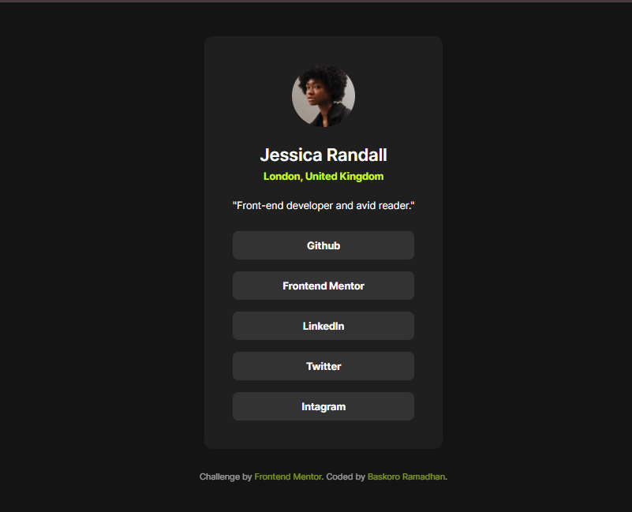

# Frontend Mentor - Social links profile solution

This is a solution to the [Social links profile challenge on Frontend Mentor](https://www.frontendmentor.io/challenges/social-links-profile-UG32l9m6dQ).

## Table of contents

- [Overview](#overview)
  - [The challenge](#the-challenge)
  - [Screenshot](#screenshot)
  - [Links](#links)
- [My process](#my-process)
  - [Built with](#built-with)
  - [What I learned](#what-i-learned)
- [Author](#author)

## Overview

### The challenge

Users should be able to:
- See hover and focus states for all interactive elements on the page.
- Navigate the profile card using a keyboard (Accessibility focus).

### Screenshot

### Links

- Solution URL: [https://github.com/yourusername/social-links-profile](https://github.com/yourusername/social-links-profile)
- Live Site URL: [https://yourusername.github.io/social-links-profile/](https://yourusername.github.io/social-links-profile/)

## My process

### Built with

- **Semantic HTML5** - Focused on landmark elements (`<main>`, `<article>`, `<nav>`).
- **CSS Custom Properties** - Used for consistent color palettes and typography.
- **Flexbox** - Utilized for both the global layout (centering) and component-level layout (vertical stacking).
- **Mobile-first workflow** - Ensured responsiveness down to 320px screen width.
- **Local Fonts (@font-face)** - Implemented "Inter" font locally for better performance and offline support.

### What I learned

During this project, I reinforced my understanding of **CSS Specificity** and **Case Sensitivity**. One major learning moment was debugging why a hover state didn't trigger because of a case mismatch in class names (`.social-Links` vs `.social-links`).

I also practiced using **Semantic HTML** to ensure screen readers can easily navigate the list of social links.

### Author

Baskoro Ramadhan